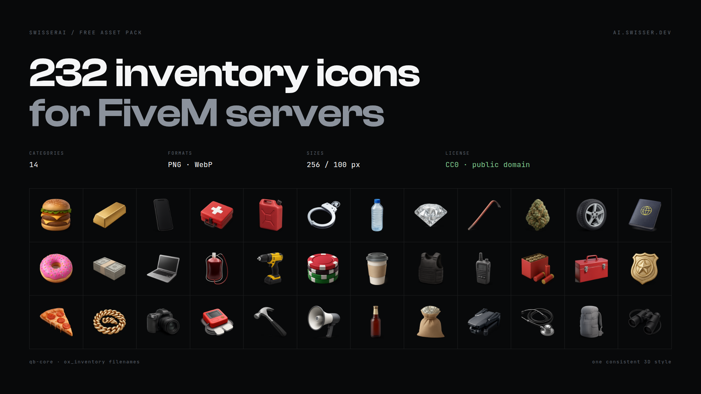

# FiveM Inventory Icons

232 inventory item icons in one consistent 3D style, on transparent
backgrounds, across 14 categories. Free for anything including commercial
servers. CC0, no credit required.

Filenames follow the qb-core `shared/items.lua` naming, so most items match an
existing entry without renaming anything.

## Download

| | | |
| --- | --- | --- |
| **Everything** | 232 icons | [`swisserai-fivem-inventory-icons-v1.0.zip`](https://github.com/SwisserDev/fivem-inventory-icons/releases/download/v1.0/swisserai-fivem-inventory-icons-v1.0.zip) |

Or grab a single category:

| Category | Icons | Download |
| --- | --- | --- |
| Food | 22 | [`swisserai-fivem-icons-food-v1.0.zip`](https://github.com/SwisserDev/fivem-inventory-icons/releases/download/v1.0/swisserai-fivem-icons-food-v1.0.zip) |
| Drinks | 18 | [`swisserai-fivem-icons-drink-v1.0.zip`](https://github.com/SwisserDev/fivem-inventory-icons/releases/download/v1.0/swisserai-fivem-icons-drink-v1.0.zip) |
| Medical | 16 | [`swisserai-fivem-icons-medical-v1.0.zip`](https://github.com/SwisserDev/fivem-inventory-icons/releases/download/v1.0/swisserai-fivem-icons-medical-v1.0.zip) |
| Ammunition | 12 | [`swisserai-fivem-icons-ammo-v1.0.zip`](https://github.com/SwisserDev/fivem-inventory-icons/releases/download/v1.0/swisserai-fivem-icons-ammo-v1.0.zip) |
| Weapon Parts | 10 | [`swisserai-fivem-icons-weapon-parts-v1.0.zip`](https://github.com/SwisserDev/fivem-inventory-icons/releases/download/v1.0/swisserai-fivem-icons-weapon-parts-v1.0.zip) |
| Tools | 22 | [`swisserai-fivem-icons-tools-v1.0.zip`](https://github.com/SwisserDev/fivem-inventory-icons/releases/download/v1.0/swisserai-fivem-icons-tools-v1.0.zip) |
| Materials | 16 | [`swisserai-fivem-icons-materials-v1.0.zip`](https://github.com/SwisserDev/fivem-inventory-icons/releases/download/v1.0/swisserai-fivem-icons-materials-v1.0.zip) |
| Vehicle Parts | 22 | [`swisserai-fivem-icons-vehicle-v1.0.zip`](https://github.com/SwisserDev/fivem-inventory-icons/releases/download/v1.0/swisserai-fivem-icons-vehicle-v1.0.zip) |
| Electronics | 18 | [`swisserai-fivem-icons-tech-v1.0.zip`](https://github.com/SwisserDev/fivem-inventory-icons/releases/download/v1.0/swisserai-fivem-icons-tech-v1.0.zip) |
| Documents | 14 | [`swisserai-fivem-icons-documents-v1.0.zip`](https://github.com/SwisserDev/fivem-inventory-icons/releases/download/v1.0/swisserai-fivem-icons-documents-v1.0.zip) |
| Valuables | 16 | [`swisserai-fivem-icons-valuables-v1.0.zip`](https://github.com/SwisserDev/fivem-inventory-icons/releases/download/v1.0/swisserai-fivem-icons-valuables-v1.0.zip) |
| Drugs | 18 | [`swisserai-fivem-icons-drugs-v1.0.zip`](https://github.com/SwisserDev/fivem-inventory-icons/releases/download/v1.0/swisserai-fivem-icons-drugs-v1.0.zip) |
| Police & Evidence | 16 | [`swisserai-fivem-icons-police-v1.0.zip`](https://github.com/SwisserDev/fivem-inventory-icons/releases/download/v1.0/swisserai-fivem-icons-police-v1.0.zip) |
| Misc | 12 | [`swisserai-fivem-icons-misc-v1.0.zip`](https://github.com/SwisserDev/fivem-inventory-icons/releases/download/v1.0/swisserai-fivem-icons-misc-v1.0.zip) |

You can also just take the files you need straight out of [`png-256/`](png-256).
No archive, no account, direct raw links.

## Install

**qb-inventory**

```bash
cp png-256/*.png resources/[qb]/qb-inventory/html/images/
```

**ox_inventory**

```bash
cp png-256/*.png resources/[ox]/ox_inventory/web/images/
```

For a custom item, point its `image` field at the matching filename.

## Formats

| Folder | Size | Use |
| --- | --- | --- |
| [`png-256/`](png-256) | 256×256 PNG | The main set, transparent. What most inventories want. |
| [`webp-256/`](webp-256) | 256×256 WebP | Same icons, roughly 70% smaller. |
| [`webp-100/`](webp-100) | 100×100 WebP | Game-native size, smallest download for players. |

`items.json` lists every icon with its category and label.

## What's in it


<details>
<summary><b>Food</b> (22 icons)</summary>

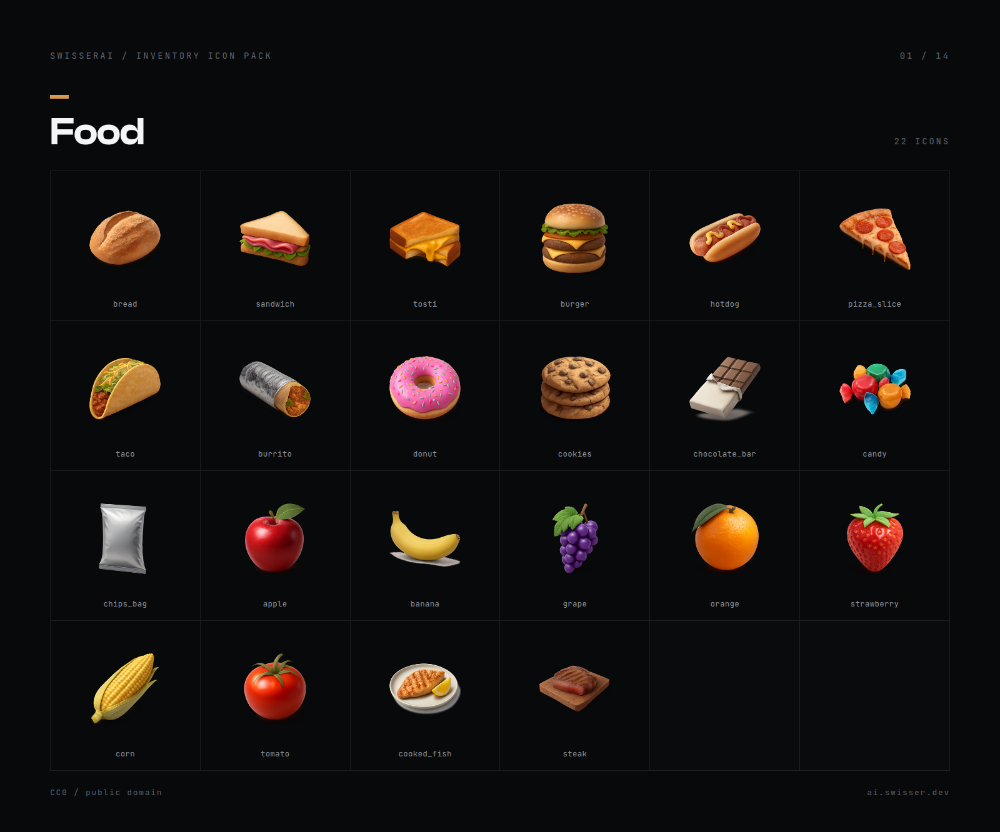

`bread` · `sandwich` · `tosti` · `burger` · `hotdog` · `pizza_slice` · `taco` · `burrito` · `donut` · `cookies` · `chocolate_bar` · `candy` · `chips_bag` · `apple` · `banana` · `grape` · `orange` · `strawberry` · `corn` · `tomato` · `cooked_fish` · `steak`

</details>

<details>
<summary><b>Drinks</b> (18 icons)</summary>

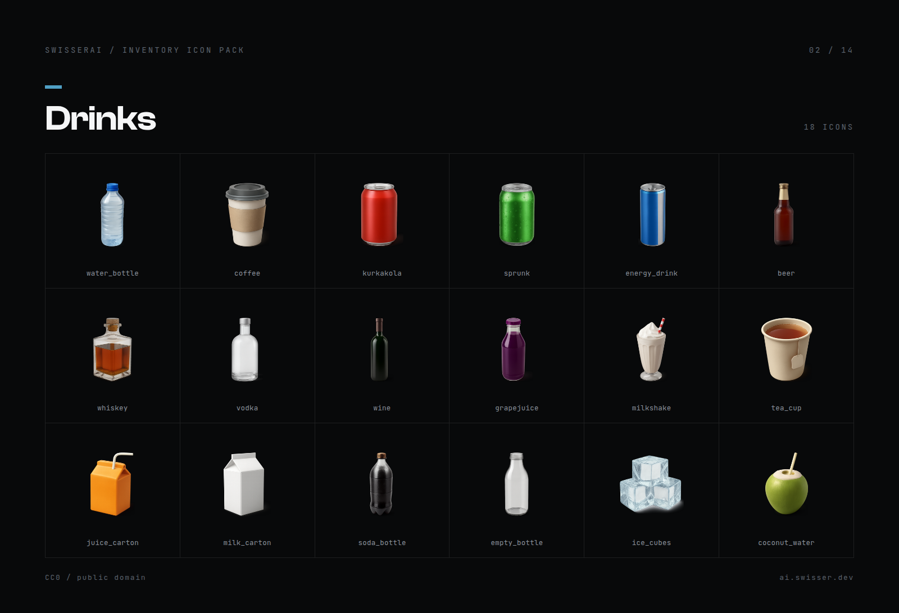

`water_bottle` · `coffee` · `kurkakola` · `sprunk` · `energy_drink` · `beer` · `whiskey` · `vodka` · `wine` · `grapejuice` · `milkshake` · `tea_cup` · `juice_carton` · `milk_carton` · `soda_bottle` · `empty_bottle` · `ice_cubes` · `coconut_water`

</details>

<details>
<summary><b>Medical</b> (16 icons)</summary>

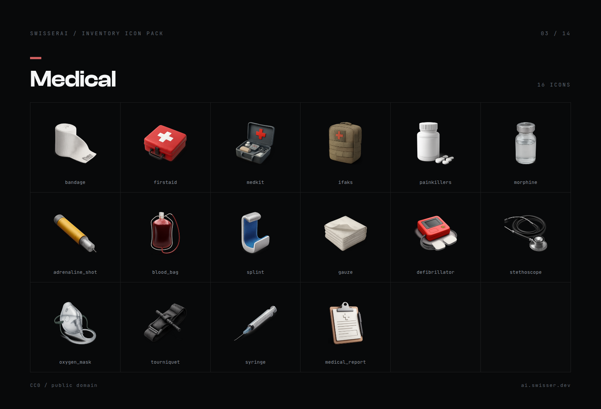

`bandage` · `firstaid` · `medkit` · `ifaks` · `painkillers` · `morphine` · `adrenaline_shot` · `blood_bag` · `splint` · `gauze` · `defibrillator` · `stethoscope` · `oxygen_mask` · `tourniquet` · `syringe` · `medical_report`

</details>

<details>
<summary><b>Ammunition</b> (12 icons)</summary>

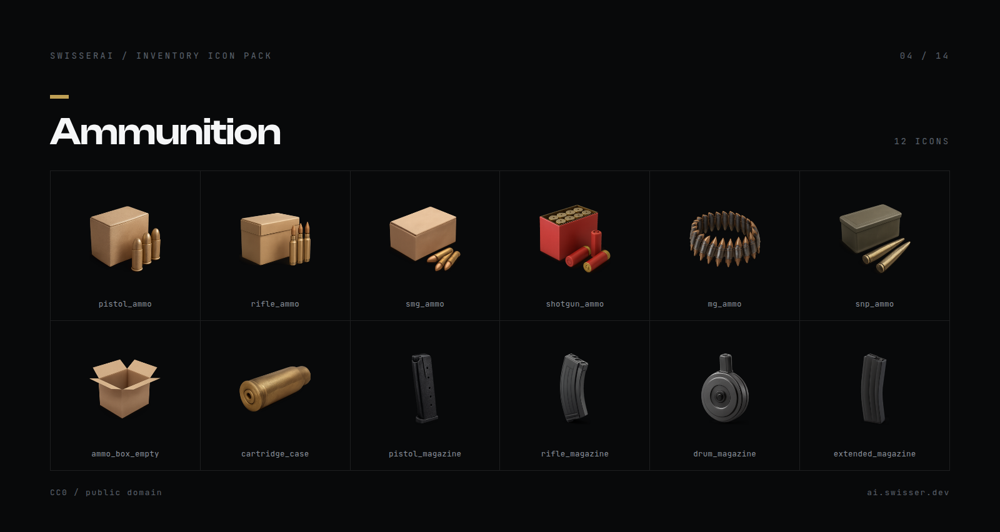

`pistol_ammo` · `rifle_ammo` · `smg_ammo` · `shotgun_ammo` · `mg_ammo` · `snp_ammo` · `ammo_box_empty` · `cartridge_case` · `pistol_magazine` · `rifle_magazine` · `drum_magazine` · `extended_magazine`

</details>

<details>
<summary><b>Weapon Parts</b> (10 icons)</summary>

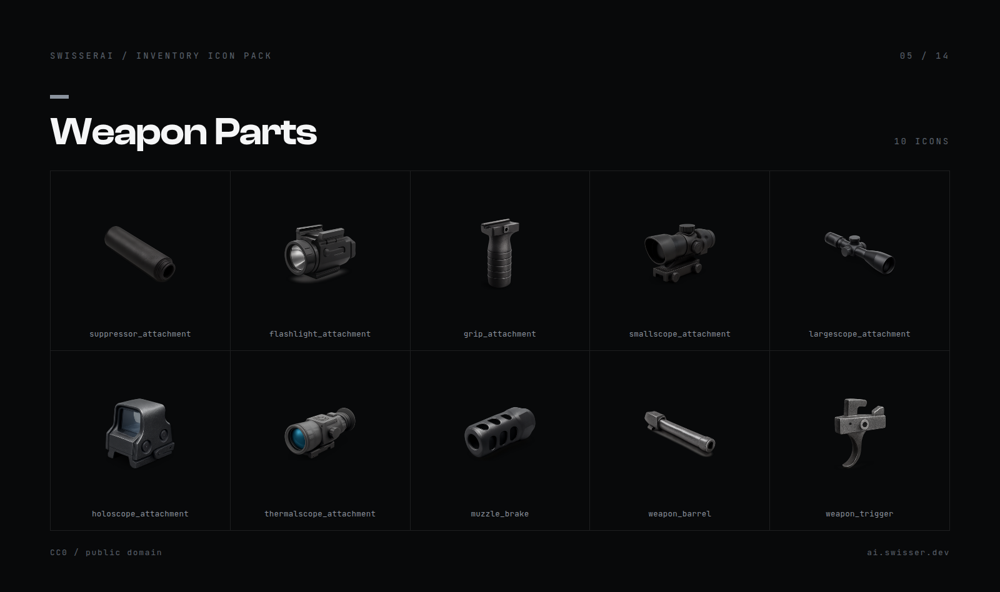

`suppressor_attachment` · `flashlight_attachment` · `grip_attachment` · `smallscope_attachment` · `largescope_attachment` · `holoscope_attachment` · `thermalscope_attachment` · `muzzle_brake` · `weapon_barrel` · `weapon_trigger`

</details>

<details>
<summary><b>Tools</b> (22 icons)</summary>

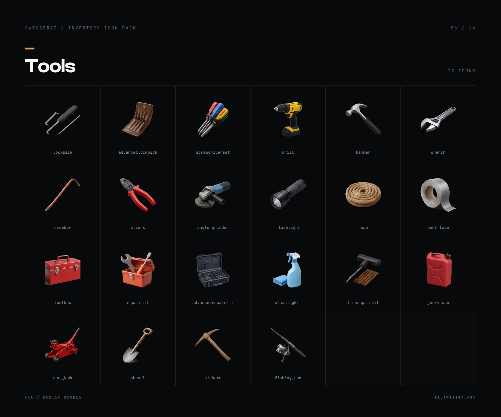

`lockpick` · `advancedlockpick` · `screwdriverset` · `drill` · `hammer` · `wrench` · `crowbar` · `pliers` · `angle_grinder` · `flashlight` · `rope` · `duct_tape` · `toolbox` · `repairkit` · `advancedrepairkit` · `cleaningkit` · `tirerepairkit` · `jerry_can` · `car_jack` · `shovel` · `pickaxe` · `fishing_rod`

</details>

<details>
<summary><b>Materials</b> (16 icons)</summary>

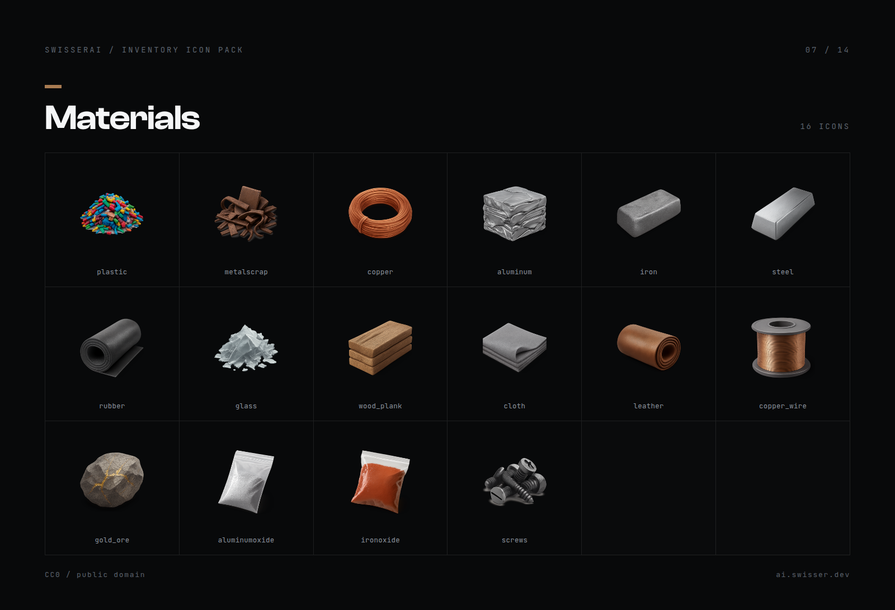

`plastic` · `metalscrap` · `copper` · `aluminum` · `iron` · `steel` · `rubber` · `glass` · `wood_plank` · `cloth` · `leather` · `copper_wire` · `gold_ore` · `aluminumoxide` · `ironoxide` · `screws`

</details>

<details>
<summary><b>Vehicle Parts</b> (22 icons)</summary>

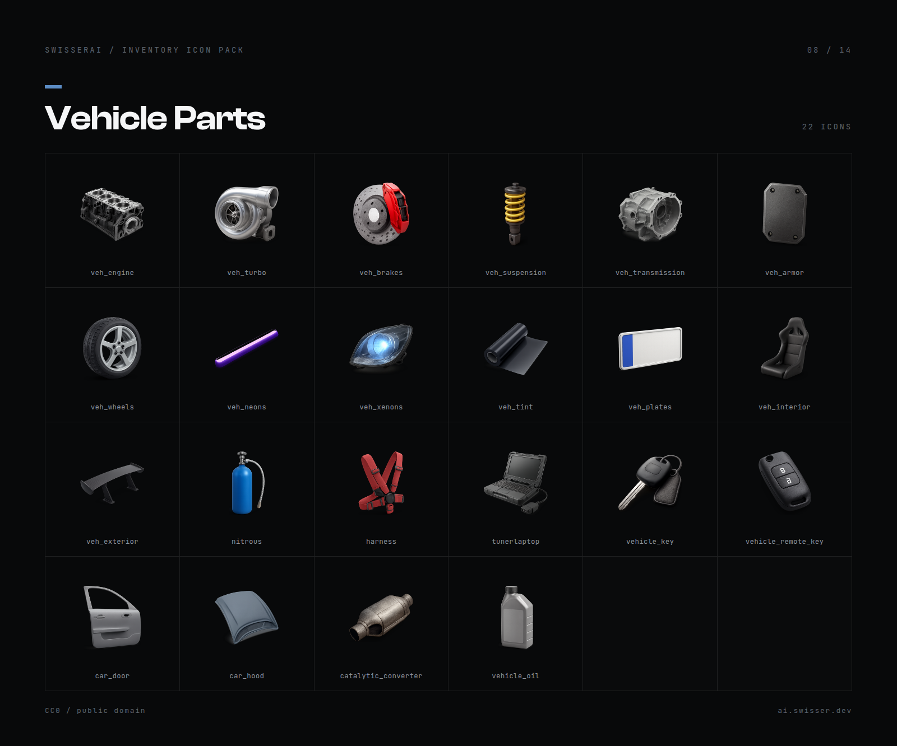

`veh_engine` · `veh_turbo` · `veh_brakes` · `veh_suspension` · `veh_transmission` · `veh_armor` · `veh_wheels` · `veh_neons` · `veh_xenons` · `veh_tint` · `veh_plates` · `veh_interior` · `veh_exterior` · `nitrous` · `harness` · `tunerlaptop` · `vehicle_key` · `vehicle_remote_key` · `car_door` · `car_hood` · `catalytic_converter` · `vehicle_oil`

</details>

<details>
<summary><b>Electronics</b> (18 icons)</summary>

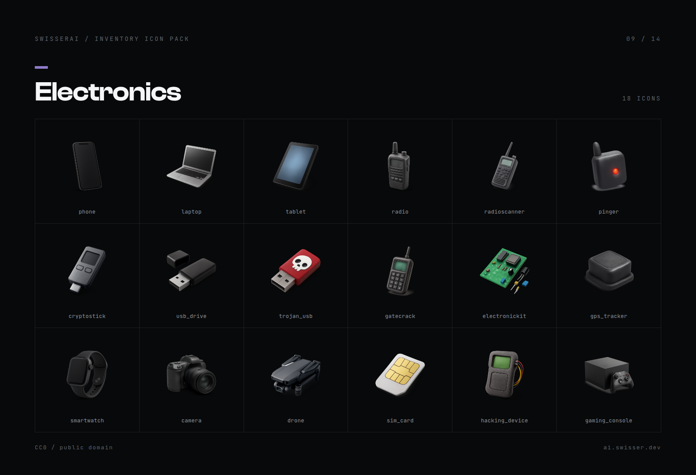

`phone` · `laptop` · `tablet` · `radio` · `radioscanner` · `pinger` · `cryptostick` · `usb_drive` · `trojan_usb` · `gatecrack` · `electronickit` · `gps_tracker` · `smartwatch` · `camera` · `drone` · `sim_card` · `hacking_device` · `gaming_console`

</details>

<details>
<summary><b>Documents</b> (14 icons)</summary>

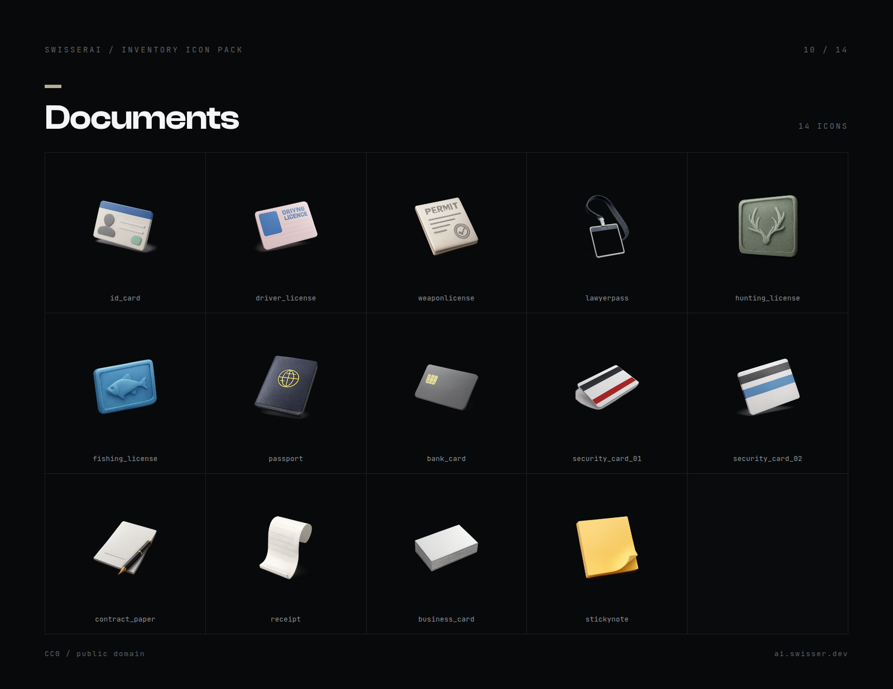

`id_card` · `driver_license` · `weaponlicense` · `lawyerpass` · `hunting_license` · `fishing_license` · `passport` · `bank_card` · `security_card_01` · `security_card_02` · `contract_paper` · `receipt` · `business_card` · `stickynote`

</details>

<details>
<summary><b>Valuables</b> (16 icons)</summary>

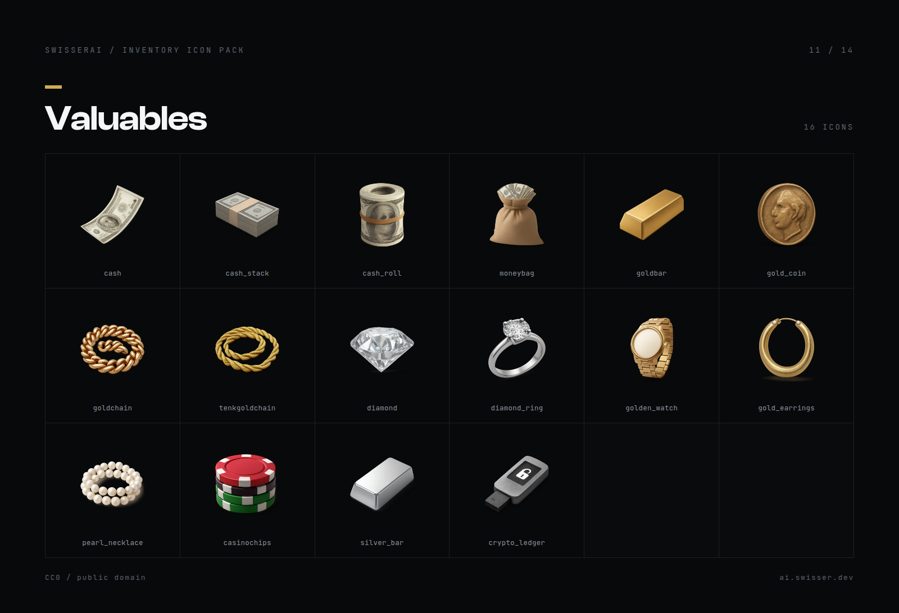

`cash` · `cash_stack` · `cash_roll` · `moneybag` · `goldbar` · `gold_coin` · `goldchain` · `tenkgoldchain` · `diamond` · `diamond_ring` · `golden_watch` · `gold_earrings` · `pearl_necklace` · `casinochips` · `silver_bar` · `crypto_ledger`

</details>

<details>
<summary><b>Drugs</b> (18 icons)</summary>

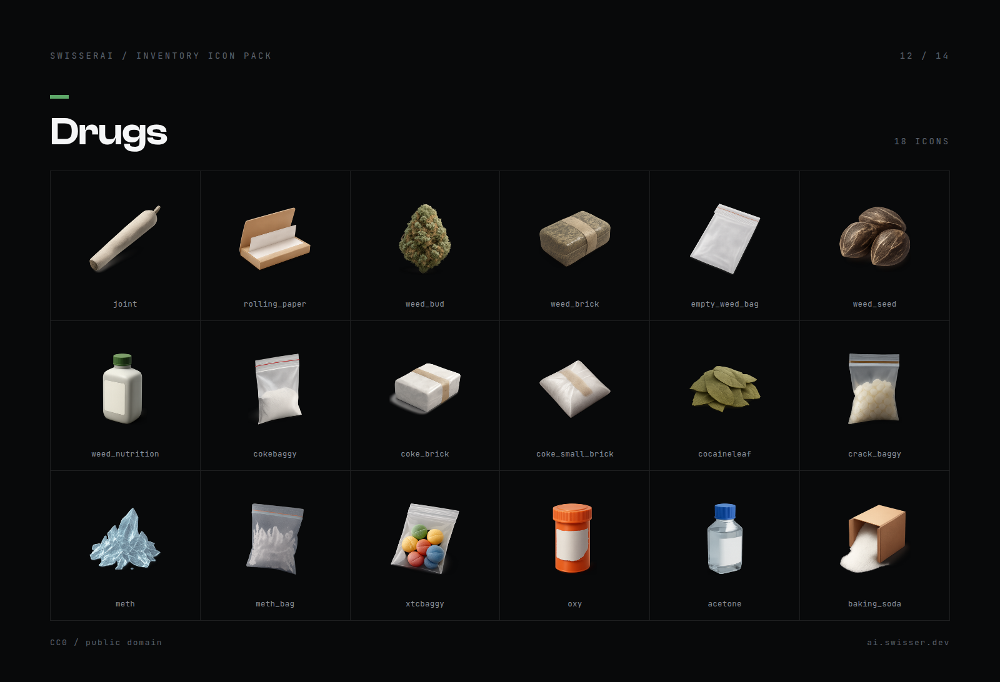

`joint` · `rolling_paper` · `weed_bud` · `weed_brick` · `empty_weed_bag` · `weed_seed` · `weed_nutrition` · `cokebaggy` · `coke_brick` · `coke_small_brick` · `cocaineleaf` · `crack_baggy` · `meth` · `meth_bag` · `xtcbaggy` · `oxy` · `acetone` · `baking_soda`

</details>

<details>
<summary><b>Police & Evidence</b> (16 icons)</summary>

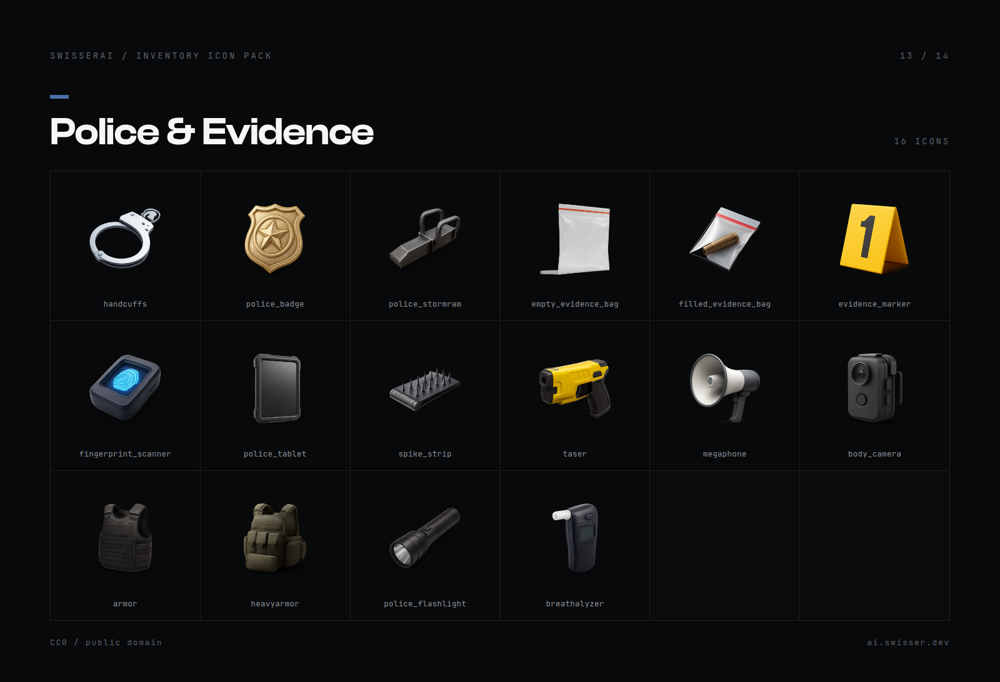

`handcuffs` · `police_badge` · `police_stormram` · `empty_evidence_bag` · `filled_evidence_bag` · `evidence_marker` · `fingerprint_scanner` · `police_tablet` · `spike_strip` · `taser` · `megaphone` · `body_camera` · `armor` · `heavyarmor` · `police_flashlight` · `breathalyzer`

</details>

<details>
<summary><b>Misc</b> (12 icons)</summary>

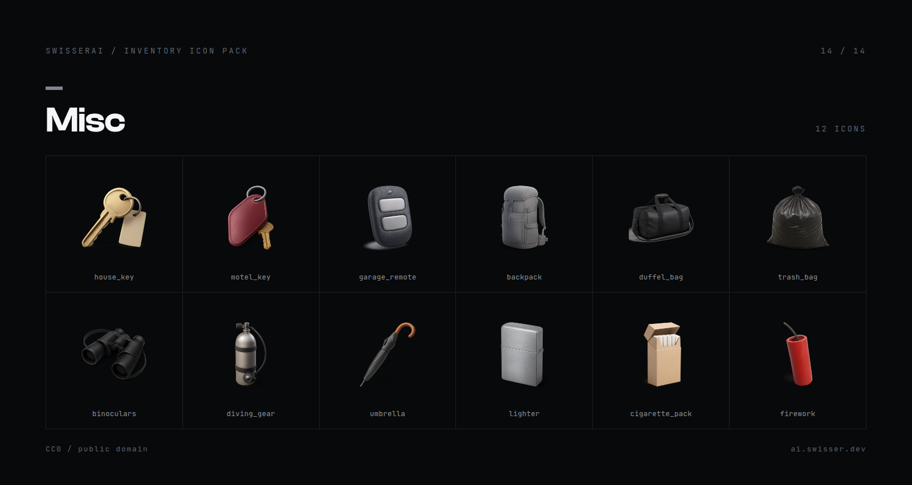

`house_key` · `motel_key` · `garage_remote` · `backpack` · `duffel_bag` · `trash_bag` · `binoculars` · `diving_gear` · `umbrella` · `lighter` · `cigarette_pack` · `firework`

</details>

## Notes

The icons are AI generated, then run through a fixed normalisation pass: tight
alpha crop ignoring the drop shadow, uniform fill ratio, centred on a square
canvas. That is why they sit the same way in a slot instead of jumping around in
size. A prompt alone doesn't get you that.

No real-world trademarks are depicted. Where an item would normally reference a
brand, it uses a generic or GTA-lore equivalent: a plain red can instead of a
named cola, no named firearms.

## License

[CC0 1.0 Universal](LICENSE), public domain. Use them, change them, ship them
on a paid server, redistribute them. No attribution needed.

---

Made with [SwisserAI](https://ai.swisser.dev), AI asset tools for FiveM.
